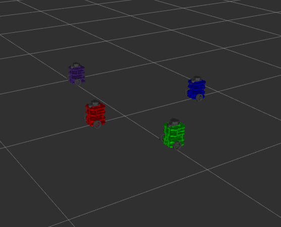

# ME495 Sensing, Navigation and Machine Learning For Robotics
* Ishani Narwankar
* Winter 2024

# Package List
This repository consists of several ROS packages
- nuturtle_description - <one sentence description>

# Nuturtle Description
URDF files for Nuturtle Donnie (like Donatello from Teenage Mutant Ninja Turtles)
* `ros2 launch nuturtle_description load_one.launch.py color:=purple` to see the robot in rviz.
* `ros2 launch nuturtle_description load_all.launch.xml` to see four copies of the robot in rviz.

* The rqt_graph when all four robots are visualized (Nodes Only, Hide Debug) is:

# Launch File Details
* `ros2 launch nuturtle_description load_one.launch.py --show-args`
  ```
  Arguments (pass arguments as '<name>:=<value>'):

    'use_rviz':
        Choose whether or not to launch rviz. Valid choices are: ['true', 'false']
        (default: 'true')

    'use_jsp':
        Launch joint_state_publisher gui or not. Valid choices are: ['true', 'false']
        (default: 'true')

    'color':
        default color for the turtlebot. Valid choices are: ['purple', 'red', 'green', 'blue', '']
        (default: 'purple')
    ```
* `ros2 launch nuturtle_description load_all.launch.xml --show-args`
    ```
    Arguments (pass arguments as '<name>:=<value>'):

        'use_rviz':
            Choose whether or not to launch rviz. Valid choices are: ['true', 'false']
            (default: 'true')

        'use_jsp':
            Launch joint_state_publisher gui or not. Valid choices are: ['true', 'false']
            (default: 'true')

        'color':
            default color for the turtlebot. Valid choices are: ['purple', 'red', 'green', 'blue', '']
            (default: 'purple')
    ```

