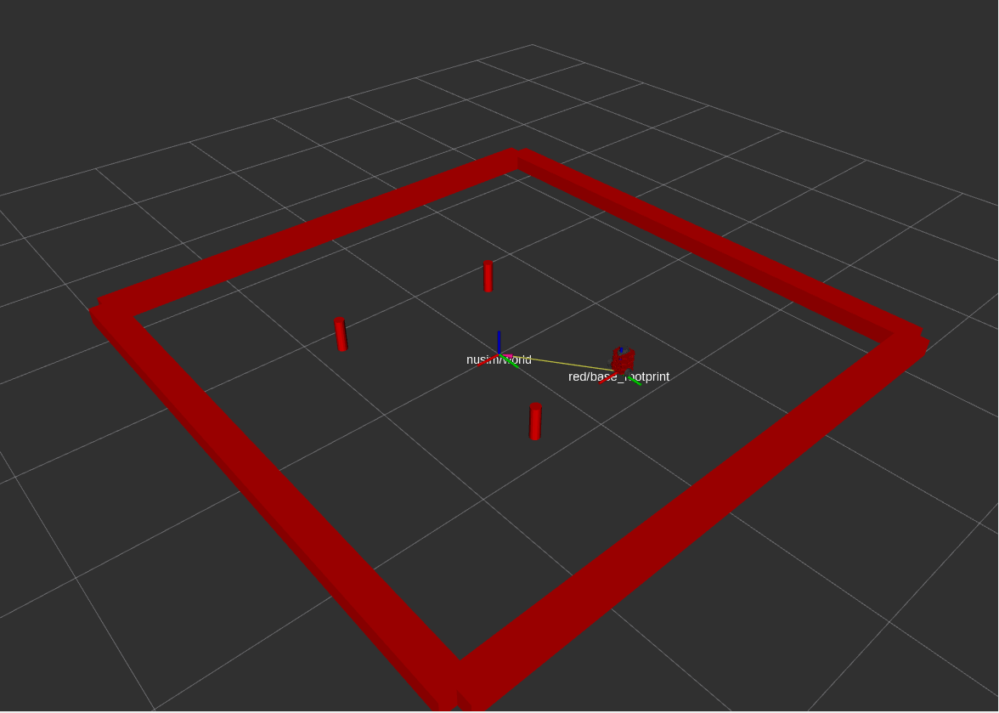

# Nusim
This package provides a simulated turtlebot environment (including obstacles and stationary walls).

* `ros2 launch nusim nusim.launch.xml ` to see the robot, arena, and obstacles in rviz (they are all ground truth and are therefore shown in red).



# Launch File Details
* `ros2 launch nuturtle_description load_one.launch.py --show-args`
  ```
  ros2 launch nusim nusim.launch.xml --show-args
```
Arguments (pass arguments as '<name>:=<value>'):

    'config_file':
        no description given
        (default: 'config/basic_world.yaml')

    'use_rviz':
        Choose whether or not to launch rviz. Valid choices are: ['true', 'false']
        (default: 'true')

    'use_jsp':
        Launch joint_state_publisher gui or not. Valid choices are: ['true', 'false']
        (default: 'true')

    'color':
        default color for the turtlebot. Valid choices are: ['purple', 'red', 'green', 'blue', '']
        (default: 'purple')
        ```