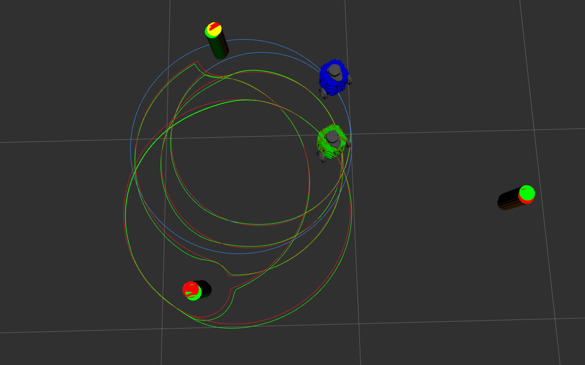

# Nuslam
This package includes the Slam node which implements an Extended Kalman Filter for SLAM on a turtlebot3. The slam.launch.xml file launches the slam node as well as an RVIZ visualization of the EKF Slam implementation.

## Quickstart
To run this node in RVIZ and visualize it as shown in the demo video below run the following command:
```ros2 launch nuslam slam.launch.xml robot:=nusim cmd_src:=circle```

To start moving the simulated turtlebots in a circle run the following command:
```ros2 service call /control nuturtle_control/srv/Control "{velocity: 0.1, radius: 1.0}"```

Feel free to change the velocity and radius inputs as desired.

Note: In the demonstration video below, I commanded the turtlebots to draw circles of radii 0.5m and 0.6m.

## Slam Node Parameters:
- slam_body_id
- slam_odom_id
- wheel_left
- wheel_right
- wheel_radius
- track_width

## Demo Video
The following video demonstrates the EKF implementation in the slam node being run in a noiseless environment:
